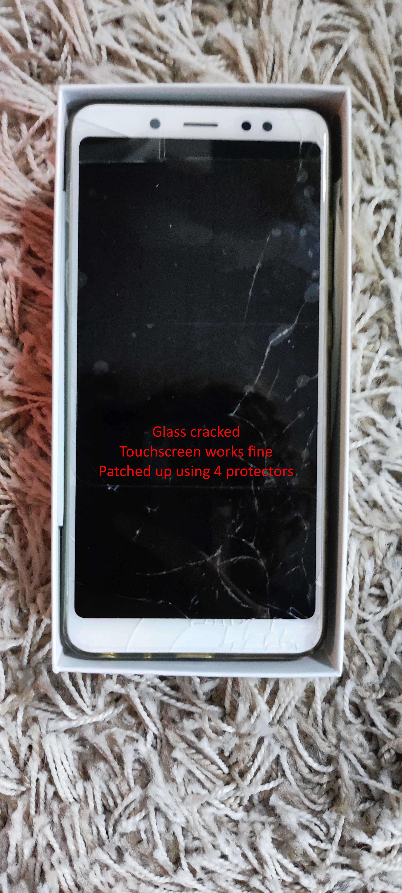

# Xiaomi Redmi Note 5

Objective info taken from [PhoneArena](https://www.phonearena.com/phones/Xiaomi-Redmi-Note-5_id10754).
The phone's battery is depleted at the time of writing this, therefore more accurate info will come later.

## Metadata

| Acquisition | End of life   | Reasons for EOL                                                                       |
|-------------|---------------|---------------------------------------------------------------------------------------|
| August 2018 | March 2020(?) | Fell face down on the ground, screen is cracked, could not repair (COVID-19 lockdown) |

## Technical characteristics
### Core

| Original OS  | Current OS        | System chip                                                                       | GPU        | RAM           |
|--------------|-------------------|-----------------------------------------------------------------------------------|------------|---------------|
| MIUI 9.5.6.0 | Around MIUI 11(?) | Qualcomm Snapdragon 636 (14 nm), Octa-core, 2000 MHz, ARM Cortex-A53, 64-bit | Adreno 506 | 3GB LPDDR3 |

### Storage

| Internal | External (potential) | External (current) |
|----------|----------------------|--------------------|
| 32GB(?)  | microSDXC ≤ 128GB    | Not Enough Info    |

### Connectivity

| Mobile data           | Bluetooth | Wi-Fi             | VoIP | Dual SIM setup                | Accepted SIM types  | Mobile hotspot & Tethering |
|-----------------------|-----------|-------------------|------|-------------------------------|---------------------|----------------------------|
| 4G (LTE, HSPA, HSUPA) | 4.2       | 802.11 a, b, g, n | Yes  | Either 2 SIMs or 1 SIM + 1 SD | Nano SIM, Micro SIM | Yes                        |

### Sensors

|Location|Motion|Hall effect|
|---|---|---|
|GPS|Accelerometer, gyroscope|Yes (for flip covers|

### Battery and charging

| Capacity | Reasonable use battery life | Port     | Standard | Replaceable battery (without tools)? |
|----------|-----------------------------|----------|----------|--------------------------------------|
| 4000mAh  | 20hrs                       | microUSB | USB 2.0  | No                                   |

### Display

| Size   | Resolution | Display Ratio | PPI | Screen to body ratio | Glass                 |
|--------|------------|---------------|-----|----------------------|-----------------------|
| 5.99in | 2160x1080  | 18:9          | 403 | 77.44%               | Corning Gorilla Glass |

The display is cracked and has been patched up with spare screen protectors.
### Media

| Rear camera           | Front camera    | 3.5mm headphone jack | Speakers    | Wireless screenshare | FM radio |
|-----------------------|-----------------|----------------------|-------------|----------------------|----------|
| 12MP                  | 5MP             | Yes                  | Earpiece    | Yes                  | Yes      |
| f2.2 aperture         |                 |                      | Loudspeaker |                      |          |
| 1.25 µm pixel size    |                 |                      |             |                      |          |
| 1920x1080 30fps video | 1920x1080 video |                      |             |                      |          |

### Design

| Dimensions         | Weight | Colour |
|--------------------|--------|--------|
| 158.5x75.45x8.05mm | 180g   | Blue   |

### Box inventory

| Power adapter | USB cable            | User guide           | SIM insertion tool | Transparent case |
|---------------|----------------------|----------------------|--------------------|------------------|
| Yes           | I forgot where it is | I forgot where it is | Yes                | On phone         |

-- info not complete; I will try to list more information if/when I charge the phone.